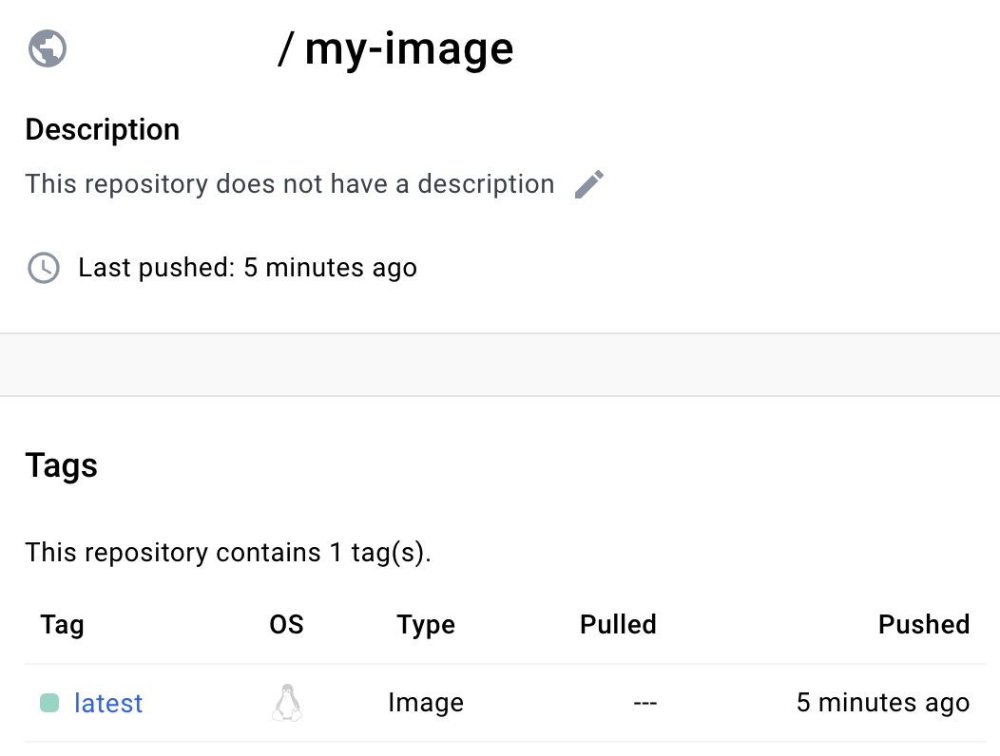
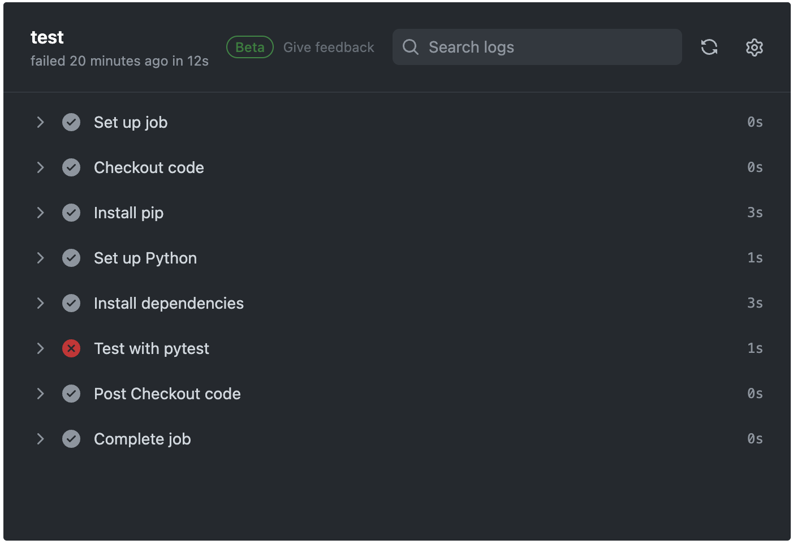
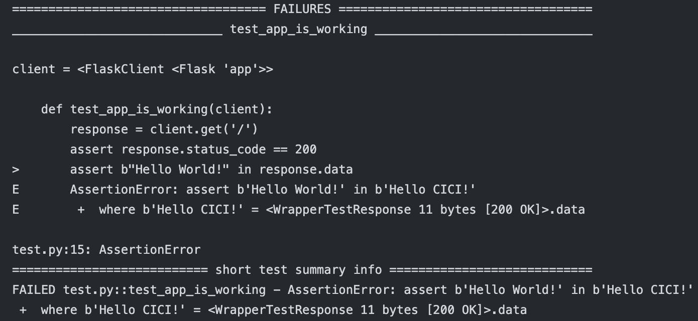
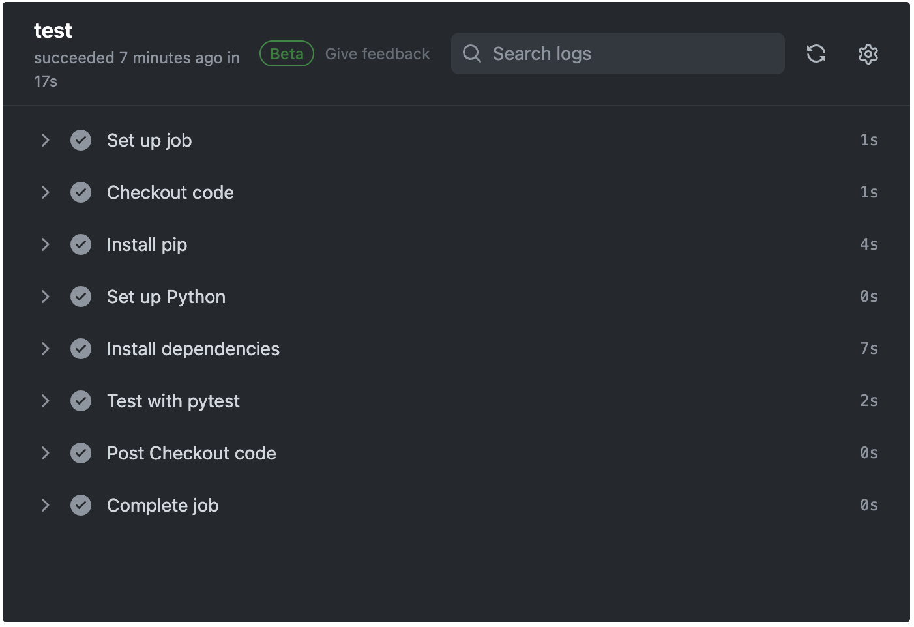

# Python Automation with GitHub Actions

This mini-project focuses on implementing a GitHub Actions CI/CD pipeline to automate Python application tasks.

The primary objective of **app.py** (the Python application) is to output "Hello World!".

The workflow, outlined in **main.yml**, consists of two jobs: build and test.

- The _build_ job involves logging into Dockerhub, executing `docker build -t` to create a Docker image based on the **Dockerfile**, and `docker push` to upload the image to a Docker Hub repository.

    

- The _test_ job uses the **test.py** to perform code testing.

## Scenario 1
In this scenario, the application is modified to return "Hello CICD!"

After validation with **test.py**, the CI/CD pipeline FAILED as expected:





## Scenario 2
In this scenario, the application is modified to return "Hello World!"

After validation with **test.py**, the CI/CD pipeline SUCCEEDED as expected:



## Troubleshooting

ImportError while importing modules in the test.py file. Fixed the issue by resolving version incompatibilities and ensuring that all dependencies were installed correctly.

## View Application

You can view and interact with the application inside a Docker container on your local machine.

- On Docker Hub, go to the _Public View_ to retrieve your _Docker Pull Command_.

    ```
    docker pull [your-username]/[your-docker-image]
    ```

- Copy and paste the docker pull command into the terminal.

- Run a container using the `docker run` command.

    ```
    docker run [your-username]/[your-docker-image]
    ```
    
    This command may expose ports or provide other instructions for accessing the application.
