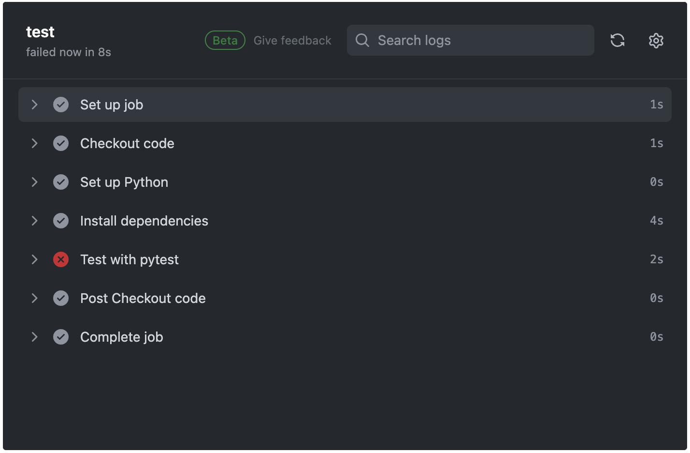

# Python Automation with GitHub Actions

This mini-project focuses on implementing a GitHub Actions CI/CD pipeline to automate Python application tasks.

The primary objective of **app.py** (the Python application) is to output "Hello World!".

The workflow, outlined in **main.yml**, consists of two jobs: build and test.

- The _build_ job involves logging into Dockerhub, executing `docker build -t` to create a Docker image based on the **Dockerfile**, and `docker push` to upload the image to a Docker Hub repository.

    

- The _test_ job uses the **test.py** to perform code testing.

## Scenario 1
In this scenario, the application is modified to return "Hello CICD!"

After validation with **test.py**, the expected outcome is that the CI/CD pipeline should **FAIL**.

## Scenario 2
In this scenario, the application is modified to return "Hello World!"

After validation with **test.py**, the expected outcome is that the CI/CD pipeline should **SUCCEED**.
